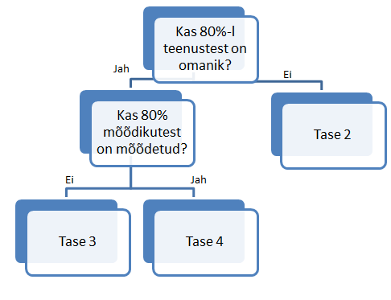

##Readme

Skript [riigiteenuste](https://github.com/MKM-ITAO/riigiteenused) andmete analüüsimiseks.

Analüüs toimub järgnevate ettapidena:

   - riigiteenuste [andmete](https://www.riigiteenused.ee/api/et/all) alla laadimine (selleks kasuta [riigiteenuste](https://github.com/RRisto/riigiteenused) paketti)
   - asutustele registrikoodi juurde lisamine Statistikaameti majanduslikult aktiivsete üksuste [tabelist](https://www.stat.ee/majandusuksuste-klassifitseerimise-abiinfo) (skript similarity_finding.R)
   - struktuuritoetuste [avaandmete](https://opendata.riik.ee/dataset/euroopa-liidu-struktuuritoetus) korrigeerimine ja agregeerimine asutuse tasemel (skript strutk_toetused.R)
   - ametnike [palkade info](http://avalikteenistus.ee/index.php?id=41596) agregeerimine asutuse tasemel (skript palgad.R)
   - riigihangete registri andmete korjamine (vaata [seda](https://github.com/RRisto/RHR-scraping) repot ja skripti küpsustase.R) 
   - teenuste juhtimise küpsustaseme määramine asutuse tasemel (skript küpsustase.R). Lähtutakse sellest mudelist:
   
   
   - Selleks, et sisuliselt binaarse küpsustasemele oleks alternatiivi, kasutatakse ka küpsusskoori (mis annab ehk rohkem info kui ainult küpsustase), mille arvutamine on kaheetapiline:
       - esmalt leitakse, mitmel protsendil teenustest on omanik
       - seejärel leitakse, mitmel protsendil teenustest (igas kanali!) on mõõdetud osutamiste arv, rahulolu, teenuse maksumus kui ka kliendi ajakulu.
       - viimakse need protsendid liidetakse (miinimumväärtus saab olla 0, maksimus aga 2)
          
   - eelnevalt agregeeritud andmete sidumine ja seoste visualiseerimine (skript küpsustase.R)
   